# pertemuan7
# Mencari angka terbesar dari 3 bilangan

 # Deklarasikan variable X,Y,Z sebagai inputan dengan tipe data integer 

x = int(input("masukan nilai x:"))

y = int(input("masukan nilai y:"))

z = int(input("masukan nilai z:"))

# Gunakan Fungsi if,elif,else

if x > y and x > z:

        
print("X adalah yang terbesar")

elif y > x and y > z:

        
print("Y adalah yang terbesar")

else :

        
print("Z adalah yang terbesar")

        
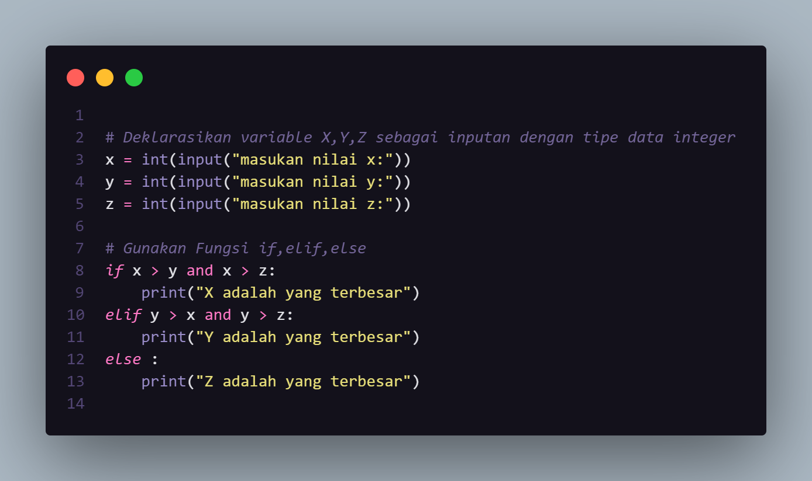

### Output
#### X bilangan terbesar

masukan nilai x:112

masukan nilai y:50

masukan nilai z:78

X yang terbesar, karena nilai X adalah: 112

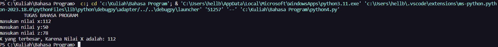
#### Y bilangan terbesar

masukan nilai x:18

masukan nilai y:302

masukan nilai z:283

Y yang terbesar, karena nilai Y adalah: 302

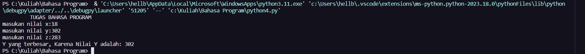
#### Z bilangan terbesar

masukan nilai x:29

masukan nilai y:12

masukan nilai z:78

Z yang terbesar, karena nilai Z adalah: 78

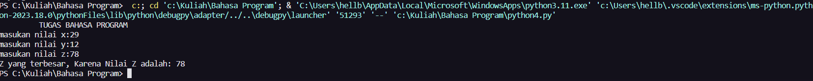
### Flowchart
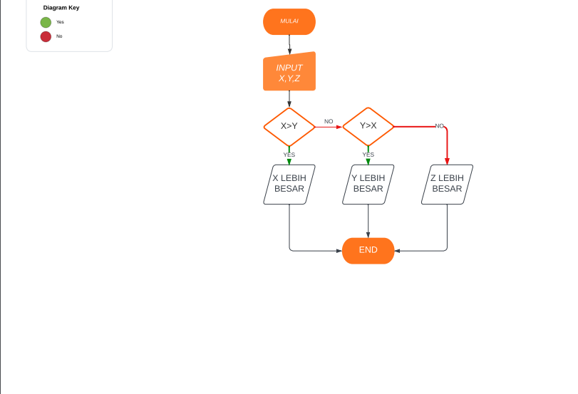

## LATIHAN 1

# Deklarasikan variable X dan Y sebagai inputan dengan tipe data integer

x = int (input("masukan nilai x:"))

y = int (input("masukan nilai y:"))

# Gunakan Fungsi if dan else

if x> y:

    
print("X yang terbesar, karena Nilai X adalah:",x)

else :

    
print("Y yang terbesar, karena Nilai Y adalah:",y)

    
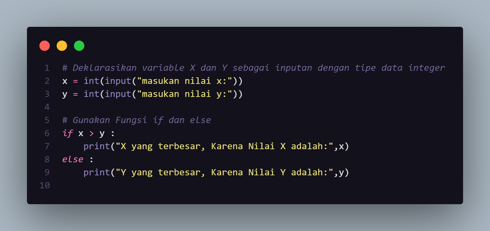
### Output

masukan nilai x:17

masukan nilai y:19

Y yang terbesar, Karena nilai Y adalah: 19

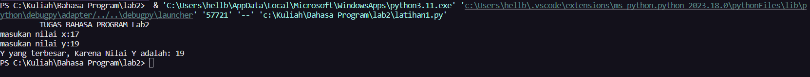

## LATIHAN 2

# Deklarasikan variable X,Y,Z sebagai inputan dengan tipe data integer

x = int(input("Bilangan ke 1:"))

y = int(input("Bilangan ke 2:"))

z = int(input("Bilangan ke 3:"))

data = [x, y, z]

list.sort(data)

print ("urutan data dari yang terkecil:",data)

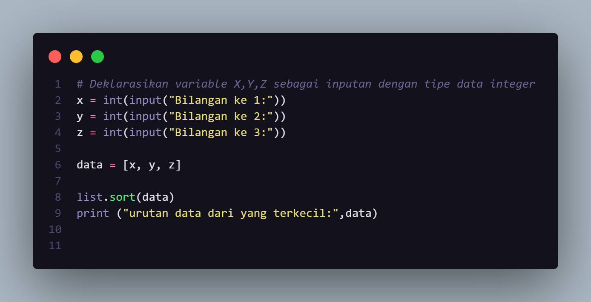
### Output

Bilangan ke 1:39

Bilangan ke 2:100

Bilangan ke 3:28

urutan data dari yang terkecil: [28, 39, 100]

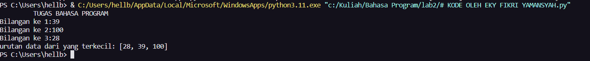

## LATIHAN 3

baris = 10

kolom = baris

for bar in range(baris):

    
for col in range(kolom):

      
tab= bar+col

      
print("{0:>5}".format(tab), end=")

    
print()

    
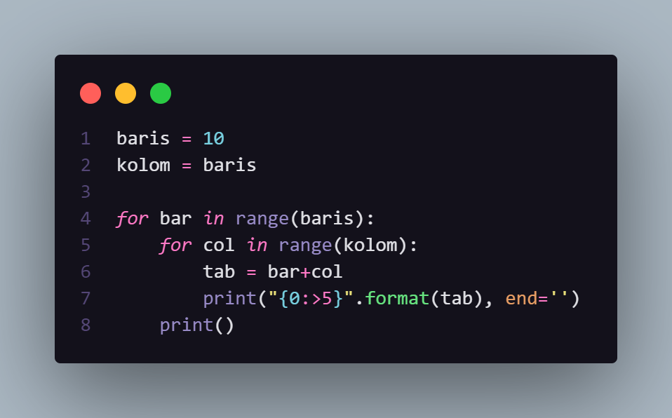
### Output
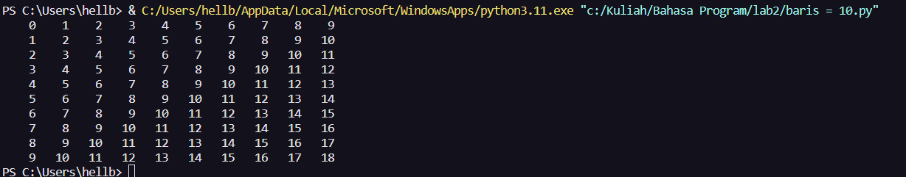

## LATIHAN 4

import random

print("\t= Bilangan acak yang lebih kecil dari 0,5 =")

jum = int( input("Masukan nilai: "))

i = 0

while i in range(jum):

i += 1

angkarandom = random.uniform(0,0.5)

print("Bilangan ke :", i, " : ", angkarandom)

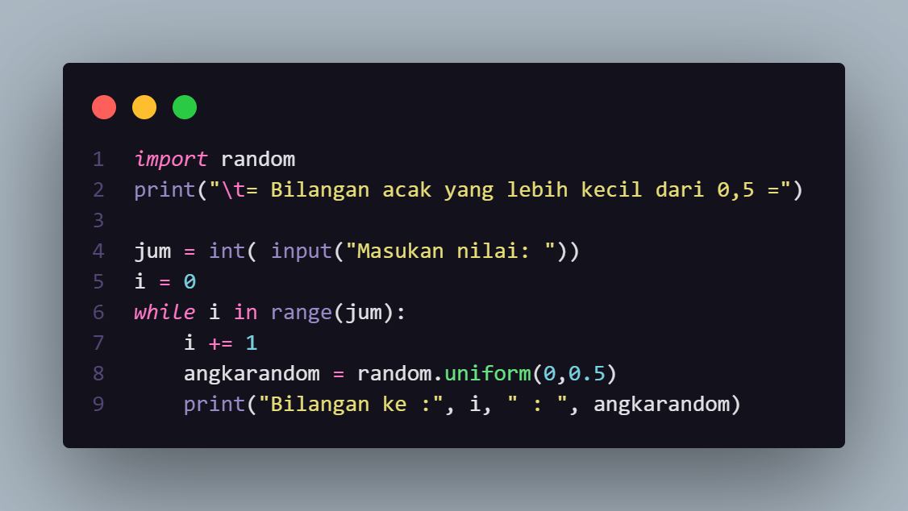
### Output

=Bilangan acak yang lebih kecil dari 0,5=

Masukan nilai: 4

Bilangan ke : 1 : 0.04082942561795605

Bilangan ke : 2 : 0.4051038920360236

Bilangan ke : 3 : 0.34840141893120163

Bilangan ke : 4 : 0.016989630897285612

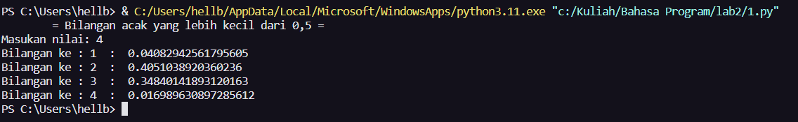

